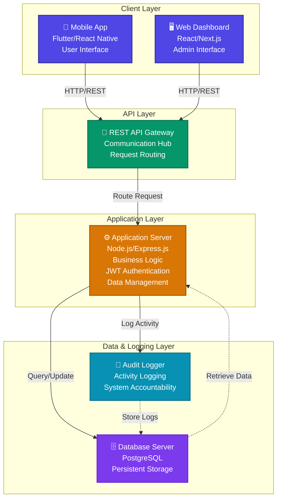
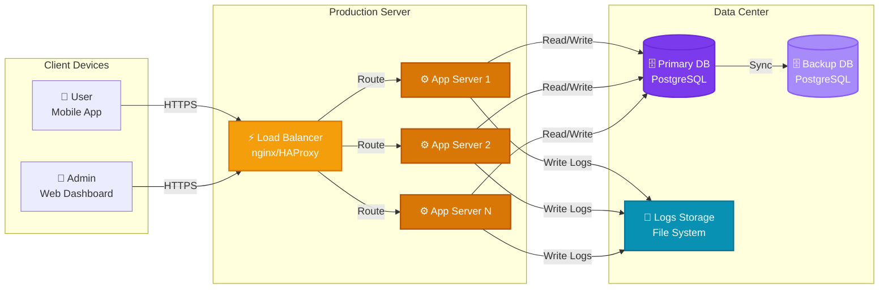

# 3.6 Arsitektur Sistem

Sistem menggunakan arsitektur **client-server** berlapis dengan komponen sebagai berikut:

## Diagram Arsitektur Sistem



---

## Penjelasan Komponen Sistem

### 1. Client Layer (Lapisan Klien)

#### **Mobile App (Flutter/React Native)**
- **Fungsi**: Interface utama untuk pengguna militer (User) mengakses lapangan
- **Fitur Utama**:
  - Login dan autentikasi
  - Dashboard dengan statistik real-time
  - Manajemen inventory
  - Pengajuan request
  - Tampilan unit dan gudang
  - Chart dan analitik
- **Teknologi**: Flutter / React Native
- **Status**: Production-ready dengan ~1,800 baris kode berkualitas tinggi

#### **Web Dashboard (React/Next.js)**
- **Fungsi**: Interface untuk Super Admin dan Admin Satuan mengelola sistem
- **Fitur Utama**:
  - Manajemen user dan role
  - Reporting dan analytics
  - Konfigurasi sistem
  - Audit trail viewing
  - Data management
- **Teknologi**: React / Next.js
- **User Type**: Super Admin, Admin Satuan

---

### 2. API Layer (Lapisan API)

#### **REST API Gateway**
- **Fungsi**: Titik komunikasi tunggal antara seluruh klien dengan backend
- **Tanggung Jawab**:
  - Request routing ke application server
  - Load balancing (jika diperlukan)
  - Request validation
  - Response formatting
  - CORS handling
- **Protokol**: HTTP/REST
- **Endpoint**: Standar RESTful dengan JSON payload

---

### 3. Application Layer (Lapisan Aplikasi)

#### **Application Server (Node.js/Express.js)**
- **Fungsi**: Core sistem yang menjalankan logika bisnis utama
- **Komponen Utama**:
  - **Authentication Module**: Menggunakan JWT untuk autentikasi aman
  - **Business Logic**: Pemrosesan request, validasi data, aturan bisnis
  - **Data Management**: CRUD operations untuk semua entitas
  - **API Endpoints**: Interface komunikasi dengan klien
- **Fitur**:
  - Validasi JWT token
  - Pengelolaan user session
  - Enkripsi data sensitif
  - Error handling terpusat
- **Teknologi**: Node.js dengan Express.js framework

---

### 4. Data & Logging Layer (Lapisan Data & Logging)

#### **Database Server (PostgreSQL)**
- **Fungsi**: Menyimpan seluruh data sistem secara persisten
- **Data yang Tersimpan**:
  - User dan role information
  - Inventory data
  - Request dan approval history
  - Unit dan warehouse data
  - Transaction logs
  - Configuration data
- **Fitur**:
  - ACID compliance (data integrity)
  - Backup dan recovery capabilities
  - Indexed queries untuk performa tinggi
  - Support untuk complex queries dan transactions

#### **Audit Logger**
- **Fungsi**: Modul khusus yang mencatat setiap aktivitas sistem
- **Informasi yang Dicatat**:
  - User login/logout events
  - Data modification (create, update, delete)
  - Access attempts (success dan failure)
  - System errors dan exceptions
  - Admin actions
- **Tujuan**: 
  - Keamanan (Security audit trail)
  - Accountability (Akuntabilitas sistem)
  - Compliance (Pemenuhan regulasi)
  - Troubleshooting (Debugging dan diagnosis)

---

## Alur Komunikasi Sistem

### 1. **User Login Flow**
```
Mobile/Web App
    ↓ POST /auth/login (email, password)
REST API Gateway
    ↓ Route to /api/auth/login
Application Server (Express.js)
    ↓ Validate credentials
PostgreSQL Database
    ↓ Check user exists & verify password
    ↓ Query result
Application Server
    ↓ Generate JWT token
Audit Logger
    ↓ Log: "User X logged in at TIME"
    ↓
Mobile/Web App: Return token + user data
```

### 2. **Data Retrieval Flow**
```
Mobile/Web App
    ↓ GET /api/inventory (with JWT token)
REST API Gateway
    ↓ Validate token, route request
Application Server
    ↓ Process request, query builder
PostgreSQL Database
    ↓ Execute query, return results
Application Server
    ↓ Format response
    ↓
Mobile/Web App: Display data
```

### 3. **Data Modification Flow**
```
Mobile/Web App
    ↓ POST /api/requests (with data)
REST API Gateway
    ↓ Route request
Application Server
    ↓ Validate input, check authorization
PostgreSQL Database
    ↓ Insert new record
    ↓ Return result
Audit Logger
    ↓ Log: "User X created request Y"
Application Server
    ↓ Format response
    ↓
Mobile/Web App: Confirm success + Refresh data
```

---

## Karakteristik Arsitektur

| Aspek | Deskripsi |
|-------|-----------|
| **Pattern** | Client-Server (3-tier architecture) |
| **Communication** | HTTP/REST dengan JSON |
| **Authentication** | JWT (JSON Web Token) |
| **Database** | PostgreSQL (relational) |
| **Scalability** | Horizontal scalable di layer aplikasi |
| **Security** | JWT auth, input validation, HTTPS |
| **Logging** | Centralized audit logging |
| **Error Handling** | Terpusat di application server |

---

## Keamanan Sistem

1. **Authentication**: JWT token-based authentication untuk semua requests
2. **Authorization**: Role-based access control (RBAC) di application layer
3. **Data Protection**: Password hashing, encrypted sensitive data
4. **Audit Trail**: Setiap aktivitas dicatat untuk accountability
5. **Input Validation**: Server-side validation untuk mencegah injection attacks
6. **HTTPS**: Enkripsi data in-transit (recommended untuk production)

---

## Deployment Architecture



---

## Technology Stack

| Layer | Teknologi | Versi |
|-------|-----------|-------|
| **Mobile** | Flutter | Latest stable |
| **Web Frontend** | React/Next.js | Latest LTS |
| **API** | Node.js + Express | 18 LTS / 5.x |
| **Database** | PostgreSQL | 14+ |
| **Authentication** | JWT | Standard |
| **Deployment** | Docker (optional) | Latest |
| **Monitoring** | PM2/systemd | - |

---

## Skalabilitas & Performa

- **Horizontal Scaling**: Application server dapat di-scale horizontally dengan load balancer
- **Database Optimization**: Query indexing dan connection pooling
- **Caching**: Redis (opsional) untuk session dan frequently accessed data
- **CDN**: Static assets dapat di-serve melalui CDN
- **Monitoring**: PM2 atau systemd untuk process management dan auto-restart

---

## Disaster Recovery

- **Database Backup**: Regular automated backups ke storage eksternal
- **Replication**: PostgreSQL streaming replication untuk high availability
- **Audit Logs**: Persistent storage untuk audit trail di file system atau separate DB
- **Failover**: Load balancer dapat mendeteksi down server dan route ke server lain

---

*Diagram ini menunjukkan arsitektur sistem ABP Military secara komprehensif dengan semua komponen dan alur komunikasinya.*
